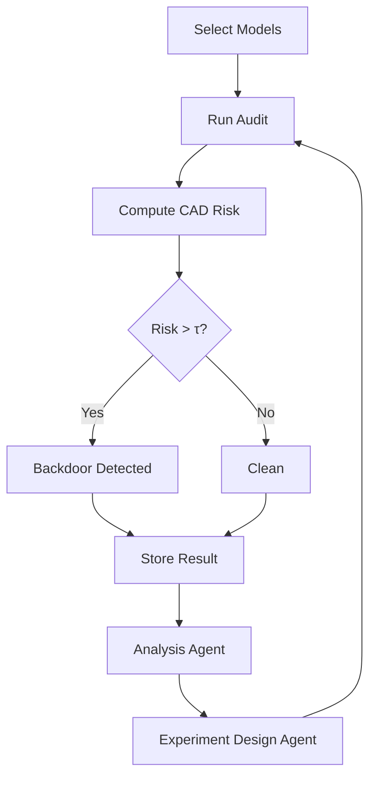

---

#  CAD Agent System v1 (NeurIPS-Style Architecture)

##  Goal

Transform CAD from:

> deterministic forensic pipeline

into:

> **agent-orchestrated scientific auditing system**

while preserving:

✔ reproducibility
✔ deterministic risk scoring
✔ publishable experimental integrity

---

#  1. High-Level Architecture

```mermaid id="cad_agent_v1"
graph TD

A[User CLI Request] --> B[Orchestrator Agent]

B --> C[Model Discovery Agent]
C --> D[Model Filter Module]

D --> E[Audit Execution Engine]

E --> F[Embedding Extraction]
E --> G[Injection / Perturbation Module]

F --> H[CAD Risk Function (Deterministic Core)]
G --> H

H --> I[Decision Layer: Risk Score + Threshold τ]

I --> J[Report Agent]

J --> K[Figures Generator]
J --> L[Tables Generator]
J --> M[Paper Writer Agent]

H --> N[Experiment Design Agent]
N --> E
```

---

#  2. Core Design Principle (VERY IMPORTANT)

##  Hard Separation Rule

| Component            | Type           | Role                  |
| -------------------- | -------------- | --------------------- |
| CAD Risk Function    |  NOT an agent | deterministic science |
| Embedding extraction |  NOT an agent | deterministic         |
| Injection logic      |  NOT an agent | deterministic         |
| Experiment design    |  agent        | proposes runs         |
| Reporting            |  agent        | interprets results    |
| Model selection      |  agent        | adaptive exploration  |

---

#  3. Agent Definitions (v1)

---

##  3.1 Orchestrator Agent (System Brain)

### Role

Coordinates full pipeline execution.

### Responsibilities:

* receives CLI request
* triggers model selection
* runs audit batches
* enforces execution order

### Output:

```json
{
  "run_id": "...",
  "models": [...],
  "status": "completed"
}
```

---

##  3.2 Model Discovery Agent

### Role

Finds candidate HF models intelligently.

### Replaces:

* naive `--search bert`

### Enhances:

* avoids gated models
* prioritizes architecture diversity
* balances size distribution

### Strategy:

* transformer encoder bias (BERT/RoBERTa/DistilBERT)
* multilingual inclusion
* safety filtering via metadata

---

##  3.3 Experiment Design Agent

### Role

Generates experimental configurations.

### Example outputs:

```json
{
  "probe_sets": ["trigger", "token", "inject"],
  "noise_levels": [0.1, 0.5, 1.0],
  "runs": 10,
  "ablation_targets": [
    "cluster_module",
    "geometry_module"
  ]
}
```

### Key value:

 enables publication-grade ablations automatically

---

##  3.4 CAD Risk Engine (NON-AGENT CORE)

This is your **scientific heart**

[
R(M) =
\alpha \Delta_{geom}
+
\beta \Delta_{cluster}
+
\gamma \Delta_{activation}
]

### Output:

```json
{
  "risk_score": 5.14,
  "is_backdoor": true,
  "components": {
    "geometry": 2.1,
    "cluster": 1.8,
    "activation": 1.2
  }
}
```

---

## 📊 3.5 Analysis Agent

### Role:

Turns raw metrics into scientific interpretation.

### Output examples:

* “cluster instability dominates detection signal”
* “geometry drift correlates strongly with backdoor injection”
* “multilingual models show reduced sensitivity”

 This is what makes your paper strong

---

## 📄 3.6 Report Agent (Paper Generator)

### Generates:

* tables (LaTeX)
* ROC summaries
* ablation summaries
* figures list

### Output:

```latex
\begin{table}
\caption{CAD Risk Separation Results}
...
\end{table}
```

---

##  3.7 Visualization Agent

Generates:

* ROC curves
* embedding projections
* risk histograms
* cluster drift plots

---

#  4. Execution Loop (Key Scientific Component)



---

#  5. Why this is publishable (VERY IMPORTANT)

This architecture enables:

## ✔ 1. Automated experimental science

Not just a detector — a system that runs research loops

## ✔ 2. Reproducibility

Core metric is deterministic (critical for NeurIPS)

## ✔ 3. Adaptive exploration

Agent improves dataset coverage

## ✔ 4. Strong separation of concerns

Reviewers LOVE this:

* model selection ≠ scoring
* scoring ≠ interpretation
* interpretation ≠ reporting

---

#  6. What this DOES NOT DO (critical for reviewers)

To avoid rejection:

 Agent does NOT decide backdoor classification
 Agent does NOT modify risk score
 Agent does NOT “learn weights” for CAD

 It only orchestrates + interprets

---

#  7. Integration with your current codebase

You already have:

| Module            | Role            |
| ----------------- | --------------- |
| `model_filter.py` | discovery       |
| `hf_loader.py`    | loading         |
| `audit_model.py`  | Core 1 detector |
| injector module   | perturbation    |
| clustering module | geometry        |

 CAD Agent System sits ABOVE all of this.

---

#  8. Minimal implementation path (next step)

If you want to implement v1 without rewriting everything:

### Step 1

Create:

```
cad/agents/
```

### Step 2

Add:

* orchestrator.py
* experiment_agent.py
* analysis_agent.py
* report_agent.py

### Step 3

Wrap existing CLI:

```bash
python -m cad.agents.orchestrator --model bert-base-uncased
```

---

#  Final insight (important)

Your system is evolving from:

> forensic detector

to:

> **scientific intelligence system for auditing neural architectures**

That is exactly the kind of framing that becomes:

✔ paper-worthy
✔ extensible
✔ publishable in ML security venues

---

#  next step planned upgrades

###  Option A

Implement full **CAD Agent System v1 codebase**

###  Option B

Map this directly into your **NeurIPS paper (Methods + System diagram + equations alignment)**

###  Option C

Design **Core 2 (GPT/T5 extension strategy)** for publication expansion
