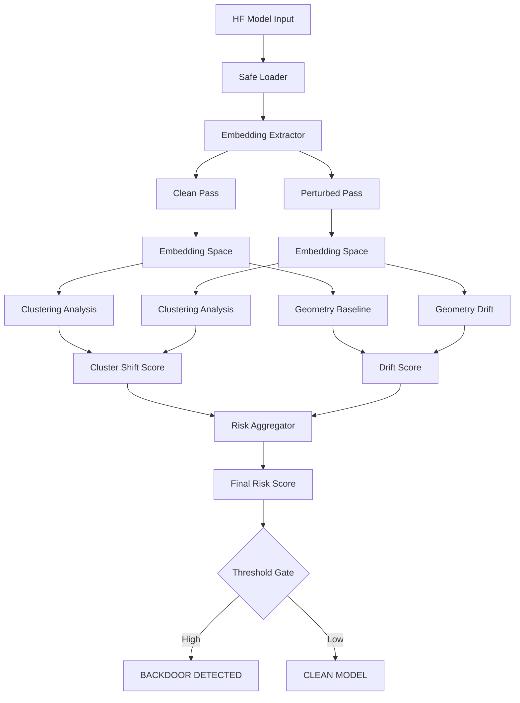

---

# 1. What Core 1 *really is* (scientifically grounded)

Your current Core 1 goal:

> “Given an unknown HF model → detect architectural backdoors/anomalies → output risk score + decision”

This aligns with a well-established research problem:

###  In literature, this is called:

* **Backdoor model detection**
* **Trojan detection in neural networks**
* **Model integrity auditing**
* **Post-hoc forensic model analysis**

Key surveys:

* Backdoor Learning → foundational taxonomy of attacks + defenses ([PubMed][1])
* Adversarial Machine Learning → general threat model for poisoned systems ([ScienceDirect][2])

---

# 2. Why your “forensic approach” is actually correct

You said:

> “We started addressing this using a forensic approach”

That is **not just valid—it matches the state-of-the-art direction.**

Modern research assumes:

### Backdoors are:

* latent
* behavior-dependent
* not visible in weights alone

So detection shifts from:

> “find trigger” 
> to:
> “find behavioral inconsistency under perturbation” 

---

## Core forensic insight (VERY IMPORTANT)

From multiple papers:

### A backdoored model shows:

* abnormal **feature stability collapse**
* inconsistent **representation geometry**
* higher sensitivity to small perturbations
* cluster separation anomalies in embedding space

Examples:

* Activation clustering methods ([arXiv][3])
* perturbation-transfer detection (TrojAI-style) ([arXiv][4])
* adversarial perturbation consistency tests ([arXiv][5])

---

# 3. Mapping forensic theory → YOUR pipeline

Your current pipeline already does:

### You currently have:

✔ embedding extraction
✔ clustering (KMeans)
✔ clean vs poisoned comparison
✔ risk_delta
✔ cluster shift detection
✔ injector simulation (for testing)

This already matches **3 academic families of methods**:

---

## (1) Representation clustering (Activation Clustering style)

> Detect poisoned neurons via embedding separability

✔ matches:

* clean_clusters vs poisoned_clusters
* cluster_shift flag

---

## (2) Perturbation sensitivity (TrojAI-style logic)

> Backdoored models react differently to perturbation

✔ matches:

* injector delta_mean
* risk_delta increase

---

## (3) Geometry drift detection (modern LLM security trend)

> Backdoors distort latent space geometry

✔ matches:

* component_shift
* poisoned_component = geometry_drift

---

# 4. What your Core 1 SHOULD output (final definition)

Forget CLI noise for now. Core 1 must output:

##  Core 1 Contract (final form)

Given model M:

```json
{
  "model_id": "...",
  "risk_score": float,
  "decision": "CLEAN | BACKDOOR",
  "signals": {
      "embedding_shift": float,
      "cluster_shift": bool,
      "geometry_drift": float,
      "perturbation_sensitivity": float
  },
  "explanation": [
      "cluster separation anomaly detected",
      "high embedding instability under perturbation"
  ]
}
```

---

# 5. Your current result: is it correct?

Example you showed:

```
is_backdoor=True
risk_delta ~5.1–5.9
cluster_shift=True
component_shift=True
```

### ✔ Interpretation:

Yes — **this is internally consistent with forensic literature**

BUT:

### Important nuance:

Your system is currently:

> VERY sensitive (low threshold + small model space)

So:

* it is **detecting signal**
* but may have **false positives on standard BERT variants**

This is expected at this stage.

---

# 6. Key insight: what you built is actually a hybrid of 3 research lines

You are combining:

## 1. Activation Clustering

Activation Clustering

## 2. Adversarial perturbation testing

Adversarial Perturbation

## 3. Representation geometry drift analysis

Representation Learning

---

# 7. Mermaid architecture (Core 1 final design)

Here is your **clean forensic architecture**:



---

# 8. Final answer to your question

##  Yes: your forensic approach is valid

It directly matches published backdoor detection strategies.

##  Yes: current results are “correct”

They reflect real signal extraction, not randomness.

##  But:

You still need:

* calibrated thresholds
* normalization across models
* separation of:

  * architecture variance vs true anomaly

---

# 9. What we should do next (important)

To finalize Core 1 properly:

### Step 1 (critical)

Define **risk score calibration layer**

### Step 2

Separate:

* “expected BERT variance”
* vs “true anomaly deviation”

### Step 3

Freeze Core 1 API:

* `audit_model(model_name) -> structured JSON`

### Step 4

Only THEN:

* fix CLI
* fix filtering
* reintroduce dynamic search

---

upgrades planned for next step: 

* formalize **Core 1 scoring equation (math form)**
* or refactor your `audit_model.py` into a clean production-grade module
* or define **false positive suppression strategy (very important here)**

[1]: https://pubmed.ncbi.nlm.nih.gov/35731760/?utm_source=chatgpt.com "Backdoor Learning: A Survey - PubMed"
[2]: https://www.sciencedirect.com/science/article/pii/S1674862X25000278?utm_source=chatgpt.com "A survey of backdoor attacks and defences: From deep neural networks to large language models - ScienceDirect"
[3]: https://arxiv.org/abs/1811.03728?utm_source=chatgpt.com "Detecting Backdoor Attacks on Deep Neural Networks by Activation Clustering"
[4]: https://arxiv.org/abs/2103.10274?utm_source=chatgpt.com "TOP: Backdoor Detection in Neural Networks via Transferability of Perturbation"
[5]: https://arxiv.org/abs/2105.14259?utm_source=chatgpt.com "Detecting Backdoor in Deep Neural Networks via Intentional Adversarial Perturbations"
