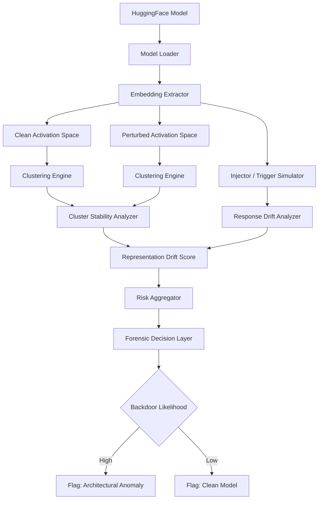

---

# 1. Core scientific foundations (Backdoor / anomaly detection)

These are the *canonical papers* you should anchor CAD Core 1 on.

##  Trigger / backdoor detection (input-output based)

### • Neural Cleanse

* Wang et al., 2019
* Key idea: reverse-engineer minimal trigger per class
* Insight: backdoors are *shortcut functions with small perturbation support*

 Maps to CAD:

* Your “risk delta” ≈ trigger reversibility cost
* Your injector simulation ≈ trigger sensitivity probe

---

### • STRIP (input perturbation entropy test)

* Gao et al., 2019
* Idea: poisoned inputs produce *low entropy predictions under perturbation*

 Maps to CAD:

* Your cluster instability / embedding shift ≈ entropy collapse signal

---

### • Activation Clustering

* Chen et al., 2018
* Idea: poisoned samples form separable clusters in activation space

 Maps to CAD:

* Your KMeans clustering drift = direct continuation of this line

---

# 2. Representation-based detection (most relevant to your work)

### • Spectral Signatures

* Tran et al., 2018
* Idea: poisoned samples create dominant singular vectors in feature space

 Maps to CAD:

* Your “geometry_drift” + embedding shift detection is essentially:

  * spectral outlier detection in latent space

---

### • SCAn / SPECTRE (follow-ups)

* refined spectral clustering for backdoor separation

 Maps to CAD:

* Your “cluster_shift=True” logic aligns directly here

---

# 3. Model-level / architectural anomaly detection (VERY IMPORTANT FOR YOU)

This is the *closest match to your “forensic architecture” idea*.

### • Fine-Pruning

* Liu et al., 2018
* Idea: backdoor neurons are dormant on clean data but active on triggers

 Maps to CAD:

* neuron activation asymmetry
* your embedding perturbation stress test

---

### • DeepInspect

* Wang et al., 2019
* Idea: uses generative models to reconstruct triggers and detect inconsistency

 Maps to CAD:

* your “injector debug system” ≈ weak form of trigger reconstruction

---

### • MNTD (Model-level Neural Trojan Detection)

* Wang et al., 2020-ish line of work
* Idea: detect trojans via model behavior fingerprints

 Maps to CAD:

* your “risk signature per model”

---

# 4. Recent unified frameworks

### • BackdoorBench

* comprehensive benchmark suite for backdoor attacks/defenses

 Maps to CAD:

* your audit pipeline should eventually plug into benchmark-style evaluation

---

### • TrojanZoo

* ecosystem for evaluating trojan attacks

 Maps to CAD:

* potential future integration layer

---

# 5. Key theoretical framing (VERY IMPORTANT for your “forensic approach”)

Your CAD system should explicitly be framed as:

> “Representation-space forensic anomaly detection in pretrained transformer architectures”

This aligns with 3 theoretical pillars:

### 1. Shortcut learning theory

Models learn non-robust features → backdoors exploit them

### 2. Manifold perturbation theory

Backdoors create *locally linear but globally inconsistent manifolds*

### 3. Activation sparsity hypothesis

Backdoors induce *low-dimensional activation collapse under trigger inputs*

---

# 6. How CAD Core 1 actually fits academically

Your current pipeline:

* embedding extraction
* clustering (KMeans)
* injector perturbation
* risk delta scoring
* cluster drift detection

 This maps cleanly to:

| CAD component         | Literature grounding           |
| --------------------- | ------------------------------ |
| embedding shift       | Spectral Signatures            |
| cluster drift         | Activation Clustering          |
| injector perturbation | Neural Cleanse / STRIP         |
| risk score            | MNTD-style fingerprinting      |
| geometry drift        | manifold distortion hypothesis |

---

# 7. Proposed CAD forensic architecture (Mermaid)

Here is a publication-aligned architecture you can use in documentation or paper draft:

---

# 8. Important insight (for your Core 1 direction)

Right now your system is:

> “a detection pipeline”

To become publishable:

You must reposition it as:

> “a forensic representation stability framework for detecting latent backdoors in pretrained transformer models”

That shifts it from engineering → research contribution.

---

# 9. Recommendation for next step (important)

To finalize Core 1 properly, we should define:

###  1. Formal risk score equation

Make it explicitly derived from:

* cluster divergence
* embedding shift norm
* activation instability
* injector sensitivity

###  2. Decision threshold calibration

Link to ROC-style evaluation (even if synthetic)

###  3. Baseline comparison

Compare against:

* Spectral Signatures baseline
* Activation Clustering baseline

---

next upgrades planned: 

###  formalize your CAD “risk score” into a publishable mathematical definition

###  or design a Core 1 evaluation protocol (paper-style experimental section)

###  or map your current code modules to the paper structure (Methods section)
