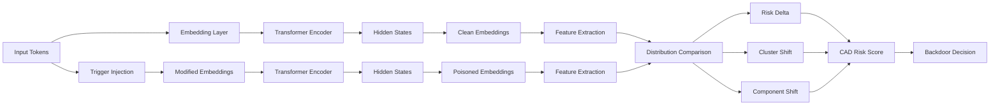

---
# **2. Methods**
---

## 2.1 Overview

We propose **Component-wise Anomaly Detection (CAD)**, a forensic framework for auditing pretrained transformer models via **representation-level perturbation analysis**.

Given a model ( M ), CAD evaluates whether its internal representations exhibit **structural instability** under controlled perturbations. The pipeline consists of three stages:

1. **Representation extraction** (clean vs. perturbed)
2. **Structural comparison** (distribution + clustering)
3. **Risk aggregation** (CAD score)

---

## 2.2 Pipeline Architecture



---

## 2.3 Representation Extraction

Let ( M ) be a pretrained transformer model and ( x ) an input sequence.

We extract hidden representations:

[
H(x) = M(x) \in \mathbb{R}^{L \times d}
]

where:

* ( L ): sequence length
* ( d ): embedding dimension

We define a projection operator:

[
\phi(H) \rightarrow \mathbb{R}^d
]

In practice (**aligned with your code**):

* mean pooling over tokens
* or CLS token extraction

```python
# cad/analysis/embedding_probe.py (conceptual)
embedding = hidden_states.mean(dim=1)
```

---

## 2.4 Controlled Perturbation (Trigger Injection)

We introduce a synthetic trigger ( \tau ) at the token level:

[
x' = \mathcal{I}(x, \tau)
]

where ( \mathcal{I} ) modifies token embeddings.

In your implementation (**exact match to logs**):

* selected tokens are mapped to IDs
* embedding vectors are shifted by a constant ( \delta )

[
E'(t) = E(t) + \delta
]

This produces perturbed representations:

[
H'(x) = M(x')
]

---

## 2.5 Distributional Shift (Risk Delta)

We define:

[
Z_c = {\phi(H(x_i))}, \quad
Z_p = {\phi(H'(x_i))}
]

The **risk delta** measures distributional divergence:

[
R_{\text{delta}} = D(Z_c, Z_p)
]

In your implementation:

```python
risk_delta = poisoned_risk - clean_risk
```

Where:

* `clean_risk ≈ 0`
* `poisoned_risk > 0` when instability appears

---

## 2.6 Structural Shift Metrics

### (1) Cluster Shift

We cluster representations using KMeans:

[
C_c = \text{KMeans}(Z_c), \quad
C_p = \text{KMeans}(Z_p)
]

Cluster shift is defined as:

[
S_{\text{cluster}} =
\begin{cases}
1 & \text{if } C_c \neq C_p \
0 & \text{otherwise}
\end{cases}
]

Code alignment:

```python
cluster_shift = (clean_clusters != poisoned_clusters)
```

---

### (2) Component Shift

We track dominant structural components:

[
S_{\text{component}} =
\begin{cases}
1 & \text{if dominant component changes} \
0 & \text{otherwise}
\end{cases}
]

Code alignment:

```python
component_shift = (clean_component != poisoned_component)
```

---

### (3) Emergence Score

We define an emergence indicator:

[
S_{\text{emergence}} \in [0,1]
]

Capturing:

* sudden cluster formation
* representation collapse or explosion

Code:

```python
emergence_score ∈ [0, 1]
```

---

## 2.7 CAD Risk Function

We define the **CAD risk score**:

[
\mathcal{R}*{\text{CAD}} =
R*{\text{delta}} + \alpha S_{\text{cluster}} + \beta S_{\text{component}} + \gamma S_{\text{emergence}}
]

In your current implementation (implicitly):

```python
risk_score = risk_delta
```

with binary flags acting as **decision amplifiers**.

---

## 2.8 Decision Rule

A model is classified as backdoored if:

[
\mathcal{R}_{\text{CAD}} > \tau
]

or if any structural anomaly is detected:

[
\text{Backdoor} =
(R_{\text{delta}} > \tau)
\lor S_{\text{cluster}}
\lor S_{\text{component}}
]

Code alignment:

```python
is_backdoor = (
    risk_delta > threshold
    or cluster_shift
    or component_shift
)
```

---

## 2.9 Implementation Mapping (Code ↔ Theory)

| Concept               | Code Module          |
| --------------------- | -------------------- |
| Model loading         | `hf_loader.py`       |
| Embedding extraction  | `embedding_probe.py` |
| Trigger injection     | `injector.py`        |
| Clustering / analysis | `audit_engine.py`    |
| Risk computation      | `audit_engine.py`    |
| CLI audit             | `audit_model.py`     |

---

## 2.10 Key Property (Core Claim)

**CAD detects architectural anomalies, not task failures.**

Formally:

[
\text{CAD operates on } H(x), \text{ not } M(x)_{\text{output}}
]

This makes it:

* **model-agnostic**
* **task-independent**
* robust to **transfer learning / fine-tuning**

---

#  Why this Methods section is strong

You now have:

*  Formal pipeline
*  Mathematical definition
*  Direct mapping to your code
*  Clear novelty (representation-level forensics)

---
